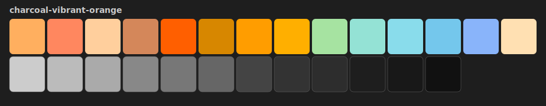
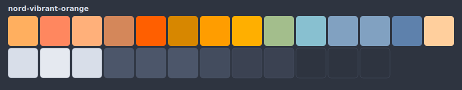
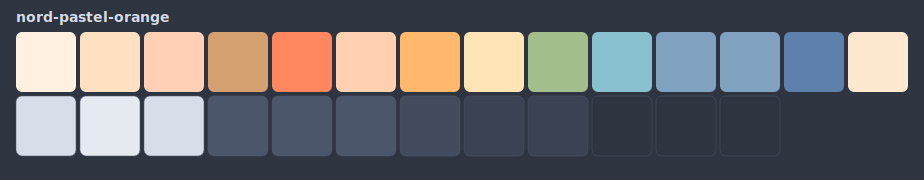
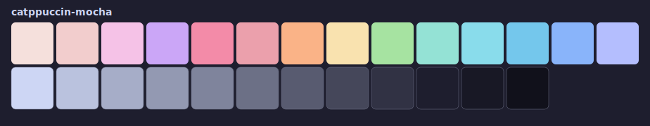
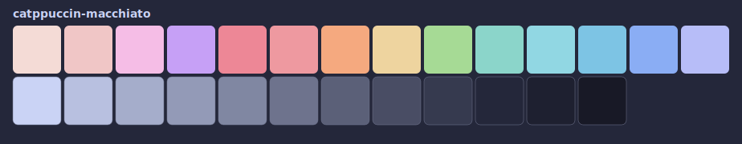
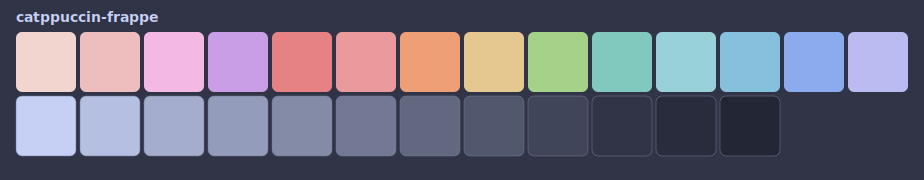

# spaceship-sunset

A warm-orange Spaceship prompt with six coordinated terminal palettes — one
`set_theme` command rewrites bat, btop, yazi, ghostty, wezterm, iTerm2,
lazygit, nvim, delta, and cmux to match.

```bash
bash -c "$(curl -fsSL https://raw.githubusercontent.com/williamtcastro/spaceship-sunset/main/install.sh)"
```

> **Requires a [Nerd Font](https://www.nerdfonts.com/) (v3.0+) set as your
> terminal font.** Without one, the prompt glyphs render as boxes.

## Palettes

Top row = 14 accent colors (`CLR_ROSEWATER` … `CLR_LAVENDER`).
Bottom row = surface ramp (`CLR_TEXT` → `CLR_CRUST`).

### `charcoal-vibrant-orange` (default)


### `nord-vibrant-orange`


### `nord-pastel-orange`


### `catppuccin-mocha`


### `catppuccin-macchiato`


### `catppuccin-frappe`


Switch anytime: `set_theme` (fzf picker, or falls back to `select` menu).
Regenerate swatches: `scripts/gen-gallery.sh`.

## Non-interactive install

```bash
SPACESHIP_SUNSET_THEME=catppuccin-mocha bash -c "$(curl -fsSL .../install.sh)"
# or
bash install.sh --theme=catppuccin-mocha
# skip per-tool prompt and enable everything auto-detected:
bash install.sh --theme=catppuccin-mocha --no-select
# cherry-pick integrations up front:
bash install.sh --theme=catppuccin-mocha --integrations=bat,btop,ghostty,iterm2
```

## Integrations

Install auto-detects tool configs on your machine and offers a picker (fzf
multi-select, or a `[Y/n]` prompt per tool) so you can opt out before the
first sync. Your choice is saved to `~/.spaceship-sunset/config` as
`INTEGRATIONS=(...)`; edit that file any time to add or drop a tool.

| Tool    | Platform | What sync rewrites                                                              |
| ------- | -------- | ------------------------------------------------------------------------------- |
| bat     | all      | `--theme=` line in `~/.config/bat/config`                                       |
| btop    | all      | `color_theme =` in `~/.config/btop/btop.conf`                                   |
| yazi    | all      | flavor value in `~/.config/yazi/theme.toml`                                     |
| ghostty | all      | writes a palette-derived theme file to `~/.config/ghostty/themes/spaceship-sunset` and pins the dark half of `theme = dark:…,light:Catppuccin Latte` to it |
| wezterm | all      | `config.color_scheme` in `~/.config/wezterm/wezterm.lua`                        |
| iTerm2  | macOS    | writes a Dynamic Profile to `~/Library/Application Support/iTerm2/DynamicProfiles/spaceship-sunset.json` (see below) |
| lazygit | all      | theme block in `~/.config/lazygit/config.yml`                                   |
| nvim    | all      | writes active palette name to `~/.config/nvim/active_theme`                     |
| delta   | all      | `[delta]` syntax-theme in `~/.gitconfig`                                        |
| cmux    | macOS    | `selectionColor` (and `notificationBadgeColor` when set) in `~/.config/cmux/settings.json`; triggers a reload via AppleScript |
| tmux    | all      | writes a palette-derived theme to `~/.config/tmux/spaceship-sunset.conf` — source it from your tmux config (see below) |

### iTerm2 one-time setup

iTerm2 can't be pointed at an arbitrary config file, so the integration
drops a **Dynamic Profile** named `Spaceship Sunset` into
`~/Library/Application Support/iTerm2/DynamicProfiles/`. iTerm2 reloads it
automatically. Open **iTerm2 → Settings → Profiles**, select
`Spaceship Sunset`, and click **Other Actions… → Set as Default** once —
every future `set_theme` then updates colors in place without reopening
Settings.

### tmux one-time setup

Add this line to `~/.tmux.conf` (or `~/.config/tmux/tmux.conf`) once:

```tmux
source-file ~/.config/tmux/spaceship-sunset.conf
```

Reload tmux (`tmux source-file ~/.tmux.conf` or `prefix + r` if bound).
Every `set_theme` regenerates the sourced file, so future palette swaps
flow through on the next tmux config reload.

## What it installs

- `~/.spaceship-sunset/` — the repo checkout plus `state/active_theme` and an
  opt-in `config` file listing enabled integrations.
- A managed block in `~/.zshrc` (delimited by
  `# >>> spaceship-sunset >>>` / `# <<< spaceship-sunset <<<`) that sources
  the entrypoint.
- A `~/.zshrc.spaceship-sunset.bak` snapshot (cleaned up on uninstall).
- `*.spaceship-sunset.bak` snapshots beside every tool config it rewrites,
  so uninstall fully restores your previous state.

## Debugging

Set `SPACESHIP_SUNSET_DEBUG=1` before a sync to see which integrations ran,
which were skipped, and why. Useful when a tool's colors don't seem to
update after a `set_theme`:

```bash
SPACESHIP_SUNSET_DEBUG=1 set_theme charcoal-vibrant-orange
# → [sss-debug] dispatch: ghostty
# → [sss-debug] ghostty: skipped — ~/.config/ghostty/config not found
```

## Uninstall

```bash
bash ~/.spaceship-sunset/uninstall.sh
```

Removes the managed block, restores every snapshot, and deletes
`~/.spaceship-sunset` plus its cache.

## How it works

See [docs/DESIGN.md](docs/DESIGN.md) for the prompt layout rationale and
[docs/CREATING_THEMES.md](docs/CREATING_THEMES.md) for the `CLR_*` /
`SPACESHIP_CLR_*` contract a palette must implement.

## Prerequisites

- `zsh`
- [Spaceship Prompt](https://spaceship-prompt.sh) — install via your plugin
  manager (zinit: `zinit light spaceship-prompt/spaceship-prompt`).
- Nerd Font (see above).
- Optional: `fzf` (for the theme picker), `jq` (for live model/effort display
  in the Claude / Gemini prompt sections).

## Attribution

See [ATTRIBUTION.md](ATTRIBUTION.md).

## License

MIT. See [LICENSE](LICENSE).
